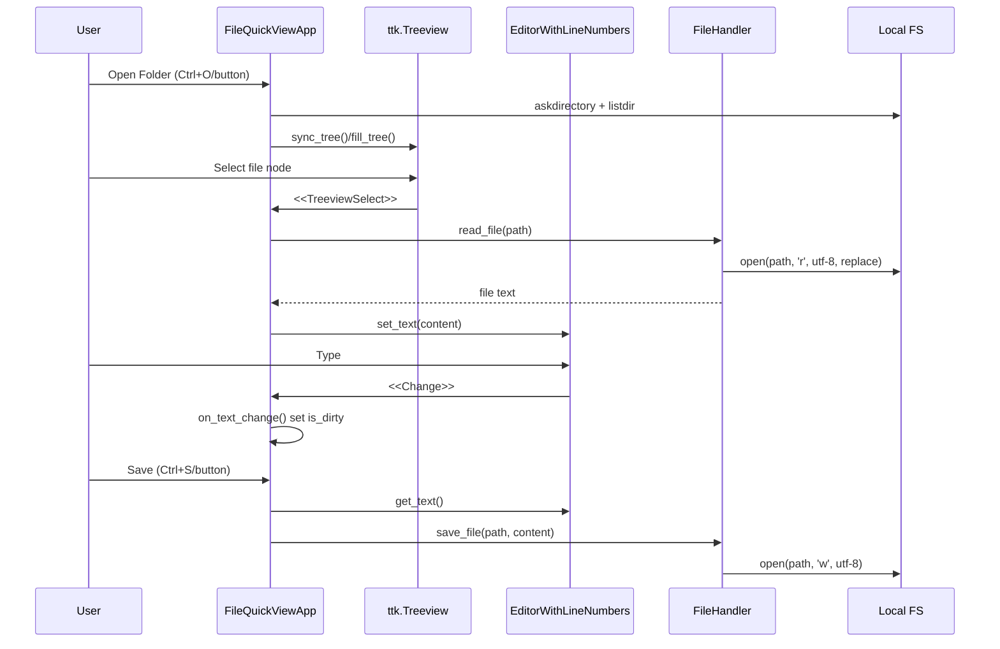

# Actual State Architecture: file_viewer

<a id="scope"></a>
## Scope
This document describes runtime architecture and execution flows as implemented in the current codebase.

<a id="repo-inventory"></a>
## 1) Repository Inventory
Important directories/files:

```text
file_viewer/
  main.py
  core/
    __init__.py
    file_handler.py
  gui/
    __init__.py
    app_window.py
    line_text.py
    syntax.py
```

Observed non-code artifacts:
- None found for packaging/deployment (`pyproject.toml`, `requirements*.txt`, `Dockerfile`, CI workflows, Makefile, etc. are absent).

### Where in code
- Repository file listing inspected via `rg --files` and recursive directory listing.

<a id="entrypoints"></a>
## 2) Entrypoints & Runtime Modes
### Entrypoint: Script execution
- Mode: Desktop GUI process (Tkinter main loop).
- How to run: `python main.py`
- Call chain:
  1. `main()`
  2. `tk.Tk()` root creation
  3. `FileQuickViewApp(root)` init
  4. `root.mainloop()` event loop

### Where in code
- `main.py:4-10`

Other runtime modes:
- CLI parser: Not found.
- `__main__.py`: Not found.
- Web server/app factory: Not found.
- Worker/scheduler/notebook entrypoints: Not found.

<a id="high-level-components"></a>
## 3) High-Level Component Diagram
```mermaid
graph TD
    U[User] --> TK[Tkinter Event System]
    TK --> APP[FileQuickViewApp\n(gui/app_window.py)]
    APP --> EDITOR[EditorWithLineNumbers\n(gui/line_text.py)]
    EDITOR --> CT[CustomText]
    EDITOR --> LN[LineNumberCanvas]
    EDITOR --> HL[PythonHighlighter\n(gui/syntax.py)]
    APP --> FH[FileHandler\n(core/file_handler.py)]
    FH --> FS[(Local File System)]
    APP --> FS
```

### Where in code
- Controller composition: `gui/app_window.py:18-60`
- Editor composition: `gui/line_text.py:49-65`
- File operations: `core/file_handler.py:5-31`

<a id="execution-flow-primary"></a>
## 4) Primary Sequence Flow: Open -> Edit -> Save


### Where in code
- Open folder: `gui/app_window.py:65-77`
- Tree fill/lazy expansion: `gui/app_window.py:79-105`
- File open: `gui/app_window.py:165-194`
- Dirty state: `gui/app_window.py:196-201`
- Save: `gui/app_window.py:203-218`
- IO details: `core/file_handler.py:5-14`

<a id="data-flow"></a>
## 5) Data Flow (Persistent Storage)
```mermaid
flowchart LR
    W[Workspace Path\ncurrent_workspace] --> T[Tree Nodes\nvalues=[full_path]]
    T --> CF[Current File\ncurrent_file]
    CF --> R[FileHandler.read_file]
    R --> BUF[Editor Text Buffer]
    BUF --> D[Dirty Flag\nis_dirty]
    BUF --> S[FileHandler.save_file]
    S --> DISK[(Disk Files)]
    N1[New File Dialog] --> C1[FileHandler.create_file] --> DISK
    N2[New Folder Dialog] --> C2[FileHandler.create_folder] --> DISK
```

### Where in code
- State vars: `gui/app_window.py:13-16`
- Tree node paths: `gui/app_window.py:75`, `gui/app_window.py:90`
- Read/save/create methods: `core/file_handler.py:5-31`
- New file/folder actions: `gui/app_window.py:138-160`

<a id="module-layering"></a>
## 6) Layering & Responsibilities
- UI/Controller layer: `gui/app_window.py`
- UI components layer: `gui/line_text.py`, `gui/syntax.py`
- Filesystem service layer: `core/file_handler.py`
- App bootstrap: `main.py`

No separate domain model, repository pattern, or service orchestration layer exists.

### Where in code
- Direct method calls from controller to IO layer: `gui/app_window.py:4`, `gui/app_window.py:178`, `gui/app_window.py:208`, `gui/app_window.py:144`, `gui/app_window.py:156`

<a id="dependencies"></a>
## 7) Dependency Map
Internal imports:
- `main.py` -> `gui.app_window.FileQuickViewApp`
- `gui.app_window` -> `core.file_handler.FileHandler`, `gui.line_text.EditorWithLineNumbers`
- `gui.line_text` -> `gui.syntax.PythonHighlighter`

Third-party packages:
- None.

Python stdlib used:
- `tkinter`, `os`, `re`, `keyword`.

### Where in code
- Import statements: `main.py:1-2`, `gui/app_window.py:1-5`, `gui/line_text.py:1-2`, `gui/syntax.py:1-2`, `core/file_handler.py:1`

<a id="side-effects"></a>
## 8) Side Effects
Filesystem reads:
- `open(..., 'r')` in `FileHandler.read_file`.
- `os.listdir`, `os.path.isdir`, `os.path.isfile` during tree and selection operations.

Filesystem writes:
- `open(..., 'w')` save.
- `open(..., 'w')` create empty file.
- `os.makedirs` create folder.

Network calls:
- None observed.

DB operations:
- None observed.

Subprocess calls:
- None observed.

Async/background tasks:
- Tkinter `after` callback for highlight debounce (single-threaded UI loop).

### Where in code
- IO methods: `core/file_handler.py:5-31`
- Tree/listdir: `gui/app_window.py:81`
- File checks: `gui/app_window.py:134`, `gui/app_window.py:171`
- Debounce scheduling: `gui/syntax.py:28-33`

<a id="config"></a>
## 9) Configuration & Secrets
- Env vars: none read.
- Config files: none.
- Secrets handling: none.
- Default values embedded in code:
  - Window title/size: `"Python Quick-Look Explorer"`, `"1200x800"`
  - Highlight debounce: 300ms
  - Highlight cutoff: 100000 chars

Precedence rules:
- Not applicable (no external config inputs found).

### Where in code
- Window defaults: `gui/app_window.py:10-11`
- Highlight defaults: `gui/syntax.py:31-32`, `gui/syntax.py:37-38`

<a id="operational-characteristics"></a>
## 10) Operational Characteristics
- Process model: single process, single GUI thread.
- Error handling: message boxes for many IO errors; directory permission errors during tree fill are suppressed.
- Observability: GUI status bar only; no file/console logs.

### Where in code
- Main loop: `main.py:7`
- Error dialogs: `gui/app_window.py:147-148`, `gui/app_window.py:159-160`, `gui/app_window.py:193-194`, `gui/app_window.py:215-216`
- Suppressed permission errors: `gui/app_window.py:94-95`

<a id="quality-tooling"></a>
## 11) Quality & Delivery Tooling
Observed absent in repository:
- tests
- CI pipelines
- lint/format/type-check config
- package metadata/build config
- container/deploy infrastructure descriptors

### Where in code
- Repo inventory includes only application Python modules and no such artifacts.
